# Notion × ArXiv 自動同期システム シーケンス図

## ドキュメント情報

- **バージョン**: 2.0.0
- **最終更新日**: 2025-11-23
- **対象システム**: ArXiv Webhook Workers
- **関連ドキュメント**: [requirements.md](./requirements.md), [architecture.md](./architecture.md)
- **主な変更**: D1 対応、テンプレート OAuth 対応、トークンリフレッシュフロー追加

---

## 目次

1. [データベース ER 図](#1-データベース-er-図)
2. [OAuth 認証フロー（テンプレート対応）](#2-oauth-認証フローテンプレート対応)
3. [OAuth コールバック時のデータベース操作フロー](#3-oauth-コールバック時のデータベース操作フロー)
4. [データベース検索・作成フロー（旧実装参考）](#4-データベース検索作成フロー旧実装参考)
5. [Webhook 受信フロー](#5-webhook-受信フロー)
6. [ArXiv 同期フロー](#6-arxiv-同期フロー)
7. [トークンリフレッシュフロー](#7-トークンリフレッシュフロー)
8. [エラーハンドリングフロー](#8-エラーハンドリングフロー)

---

## 1. データベース ER 図

### 1.1 エンティティ関係図


### 1.2 テーブル詳細

#### workspaces テーブル

| カラム名         | 型       | 制約        | 説明                         |
| ---------------- | -------- | ----------- | ---------------------------- |
| `id`             | TEXT     | PRIMARY KEY | Notion の workspace_id       |
| `workspace_name` | TEXT     | NULL 許可   | ワークスペース名             |
| `workspace_icon` | TEXT     | NULL 許可   | ワークスペースアイコンの URL |
| `created_at`     | DATETIME | DEFAULT NOW | レコード作成日時             |
| `updated_at`     | DATETIME | DEFAULT NOW | レコード更新日時             |

**インデックス**: なし（主キーのみ）

#### integrations テーブル

| カラム名           | 型       | 制約         | 説明                                      |
| ------------------ | -------- | ------------ | ----------------------------------------- |
| `bot_id`           | TEXT     | PRIMARY KEY  | Notion の bot_id（インテグレーション ID） |
| `workspace_id`     | TEXT     | NOT NULL, FK | ワークスペース ID（workspaces.id 参照）   |
| `access_token`     | TEXT     | NOT NULL     | Notion API アクセストークン               |
| `refresh_token`    | TEXT     | NOT NULL     | トークンリフレッシュ用トークン            |
| `token_expires_at` | DATETIME | NULL 許可    | トークンの推定有効期限（7 日後）          |
| `database_id`      | TEXT     | NULL 許可    | ArXiv データベースの ID                   |
| `parent_page_id`   | TEXT     | NULL 許可    | ArXiv Papers ページの ID                  |
| `created_at`       | DATETIME | DEFAULT NOW  | レコード作成日時                          |
| `updated_at`       | DATETIME | DEFAULT NOW  | レコード更新日時                          |

**外部キー制約**:

- `workspace_id` → `workspaces.id` (ON DELETE CASCADE)

**インデックス**:

- `idx_integrations_workspace`: `workspace_id` に対するインデックス
- `idx_integrations_expires`: `token_expires_at` に対するインデックス（トークンリフレッシュ用）

#### oauth_states テーブル

| カラム名     | 型       | 制約        | 説明                   |
| ------------ | -------- | ----------- | ---------------------- |
| `state`      | TEXT     | PRIMARY KEY | OAuth state 値（UUID） |
| `created_at` | DATETIME | DEFAULT NOW | レコード作成日時       |
| `expires_at` | DATETIME | NOT NULL    | state の有効期限       |

**インデックス**:

- `idx_oauth_states_expires`: `expires_at` に対するインデックス（期限切れ削除用）

**注意**: 現在は Cloudflare KV を使用しており、このテーブルは将来用として定義されています。

### 1.3 リレーションシップ

1. **workspaces ↔ integrations**
   - **関係**: 1 対多（1 つのワークスペースに複数のインテグレーションが存在可能）
   - **外部キー**: `integrations.workspace_id` → `workspaces.id`
   - **削除動作**: CASCADE（ワークスペース削除時、関連するインテグレーションも削除）

### 1.4 データフロー

```mermaid
flowchart TD
    A[OAuth コールバック] --> B[workspaces テーブル]
    A --> C[integrations テーブル]

    B --> B1[INSERT/UPDATE<br/>workspace_id, name, icon]
    C --> C1[既存連携チェック<br/>bot_id で検索]

    C1 -->|存在する| C2[UPDATE<br/>トークン、database_id 等]
    C1 -->|存在しない| C3[INSERT<br/>新規レコード作成]

    D[トークンリフレッシュ] --> C
    D --> C4[UPDATE<br/>access_token, refresh_token]

    E[Webhook 受信] --> C
    E --> C5[SELECT<br/>database_id で検索]
```



---

## 2. OAuth 認証フロー（テンプレート対応）

### 1.1 認証開始からコールバックまで


### 1.2 エラーケース


---

## 3. OAuth コールバック時のデータベース操作フロー

### 2.1 既存連携の取得とデータベース再利用

```mermaid
sequenceDiagram
    participant Workers as Cloudflare Workers<br/>(callback.ts)
    participant D1 as Cloudflare D1
    participant NotionAPI as Notion API

    Note over Workers,NotionAPI: 前提: OAuth トークン取得済み<br/>(tokenData 取得済み)

    activate Workers

    Note over Workers,NotionAPI: Phase 1: 既存連携の取得（冪等性確保）

    Workers->>D1: SELECT * FROM integrations<br/>WHERE bot_id = ?
    activate D1
    D1-->>Workers: existingIntegration | null
    deactivate D1

    Note over Workers,NotionAPI: Phase 2: Workspace の作成/更新

    Workers->>D1: INSERT INTO workspaces<br/>(id, workspace_name, workspace_icon)<br/>ON CONFLICT(id) DO UPDATE SET ...
    activate D1
    D1-->>Workers: OK
    deactivate D1

    Note over Workers,NotionAPI: Phase 3: データベースの検索/作成

    alt 既存連携が存在する場合
        Workers->>NotionAPI: GET /v1/databases/{database_id}
        activate NotionAPI

        alt データベースが存在する（200 OK）
            NotionAPI-->>Workers: { id: database_id, parent: {...}, ... }
            deactivate NotionAPI
            Workers->>Workers: databaseId = existing.id<br/>pageId = existing.parent.page_id
        else データベースが存在しない（404）
            NotionAPI-->>Workers: 404 Not Found
            deactivate NotionAPI
            Note over Workers: 新規作成に進む
        end
    end

    alt 既存データベースが存在しない、または既存連携がない場合
        Workers->>NotionAPI: POST /v1/databases<br/>{ parent: { type: "workspace" },<br/>  title: "ArXiv Papers",<br/>  properties: {...} }
        activate NotionAPI
        NotionAPI-->>Workers: { id: database_id, parent: {...} }
        deactivate NotionAPI
        Workers->>Workers: databaseId = database.id<br/>pageId = null (workspace直下)
    end

    Note over Workers,NotionAPI: Phase 4: Integration の保存

    alt 既存連携が存在する場合（更新）
        Workers->>D1: UPDATE integrations<br/>SET workspace_id = ?,<br/>    access_token = ?,<br/>    refresh_token = ?,<br/>    token_expires_at = ?,<br/>    database_id = ?,<br/>    parent_page_id = ?<br/>WHERE bot_id = ?
        activate D1
        D1-->>Workers: OK
        deactivate D1
    else 既存連携が存在しない場合（新規作成）
        Workers->>D1: INSERT INTO integrations<br/>(bot_id, workspace_id, access_token,<br/> refresh_token, token_expires_at,<br/> database_id, parent_page_id)<br/>VALUES (?, ?, ?, ?, ?, ?, ?)<br/>ON CONFLICT(bot_id) DO UPDATE SET ...
        activate D1
        D1-->>Workers: OK
        deactivate D1
    end

    Workers-->>Workers: 成功ページにリダイレクト
    deactivate Workers
```

### 2.2 エラーケース


---

## 4. データベース検索・作成フロー（旧実装参考）

### 3.1 テンプレートからのデータベース検索


### 2.2 エラーケース


---

## 5. Webhook 受信フロー

### 3.1 正常フロー


### 3.2 エラーケース


---

## 6. ArXiv 同期フロー

### 4.1 正常フロー


### 4.2 データ変換詳細


### 4.3 エラーケース


---

## 7. トークンリフレッシュフロー

### 5.1 Cron Triggers による定期リフレッシュ

```mermaid
sequenceDiagram
    participant Cron as Cloudflare<br/>Cron Triggers
    participant Workers as Cloudflare Workers<br/>(scheduled handler)
    participant D1 as Cloudflare D1
    participant NotionAPI as Notion API

    Note over Cron,NotionAPI: 6時間ごとに実行

    Cron->>Workers: scheduled event<br/>{ scheduledTime, cron }
    activate Workers

    Workers->>D1: SELECT * FROM integrations<br/>WHERE token_expires_at < datetime('now', '+24 hours')<br/>OR token_expires_at IS NULL
    activate D1
    D1-->>Workers: [integration1, integration2, ...]
    deactivate D1

    loop 各 Integration
        Workers->>NotionAPI: POST /v1/oauth/token<br/>{ grant_type: "refresh_token",<br/>  refresh_token }
        activate NotionAPI

        alt リフレッシュ成功
            NotionAPI-->>Workers: { access_token, refresh_token,<br/>  bot_id, workspace_id }
            deactivate NotionAPI

            Workers->>D1: UPDATE integrations<br/>SET access_token = ?,<br/>    refresh_token = ?,<br/>    token_expires_at = datetime('now', '+7 days')<br/>WHERE bot_id = ?
            activate D1
            D1-->>Workers: OK
            deactivate D1

            Workers->>Workers: successCount++
        else リフレッシュ失敗
            NotionAPI-->>Workers: 401 Unauthorized
            deactivate NotionAPI

            Workers->>Workers: failedCount++<br/>errors.push({ bot_id, error })
        end
    end

    Workers->>Workers: console.log({<br/>  total, success, failed, errors<br/>})

    Workers-->>Cron: 完了
    deactivate Workers
```

### 5.2 手動リフレッシュ（オプション）


### 5.3 Webhook 処理時の自動リフレッシュ


---

## 8. エラーハンドリングフロー

### 5.1 エラーキャッチと処理


### 5.2 リトライフロー


### 5.3 リトライ失敗フロー


---

## 9. 全体統合フロー

### 6.1 初回セットアップから同期まで


---

## 10. 補足情報

### 7.1 タイミング図

```mermaid
gantt
    title ArXiv 同期処理のタイミング
    dateFormat  HH:mm:ss
    axisFormat %H:%M:%S

    section User Action
    Link 入力           :done, user1, 00:00:00, 1s

    section Notion
    Automation トリガー  :done, notion1, 00:00:01, 1s
    Webhook POST       :done, notion2, 00:00:02, 1s

    section Workers
    Webhook 受信        :active, worker1, 00:00:03, 0.5s
    バリデーション       :active, worker2, 00:00:03.5, 0.5s
    KV 取得            :active, worker3, 00:00:04, 0.1s
    ArXiv API 呼び出し   :active, worker4, 00:00:04.1, 1.5s
    データ変換          :active, worker5, 00:00:05.6, 0.2s
    Notion API 呼び出し  :active, worker6, 00:00:05.8, 0.8s
    レスポンス返却       :active, worker7, 00:00:06.6, 0.1s

    section Total
    合計処理時間         :milestone, total, 00:00:06.7, 0s
```

### 7.2 シーケンス図の凡例

| 記号                      | 意味                 |
| ------------------------- | -------------------- |
| `→`                       | 同期呼び出し         |
| `-->>`                    | 同期レスポンス       |
| `--x`                     | エラーレスポンス     |
| `activate` / `deactivate` | 処理中の状態         |
| `Note over`               | 補足説明             |
| `rect`                    | フェーズのグループ化 |

---

## 11. 参考資料

### 8.1 関連ドキュメント

- [requirements.md](./requirements.md) - 要件定義書
- [architecture.md](./architecture.md) - アーキテクチャ設計書
- [types.md](./types.md) - TypeScript 型定義仕様

### 8.2 外部リソース

- [Mermaid Documentation](https://mermaid.js.org/) - シーケンス図の記法
- [Notion API Documentation](https://developers.notion.com/) - Notion API 仕様
- [ArXiv API Documentation](https://info.arxiv.org/help/api/index.html) - ArXiv API 仕様

---

## 12. 変更履歴

| バージョン | 日付       | 変更内容                                                                          | 担当者 |
| ---------- | ---------- | --------------------------------------------------------------------------------- | ------ |
| 2.0.0      | 2025-11-23 | D1 対応、テンプレート OAuth 対応、トークンリフレッシュフロー追加、KV を D1 に移行 | -      |
| 1.0.0      | 2025-11-22 | 初版作成                                                                          | -      |

---

**このドキュメントは、ArXiv Notion 同期システムの動作フローを可視化し、実装時の理解を助けるために作成された。**
